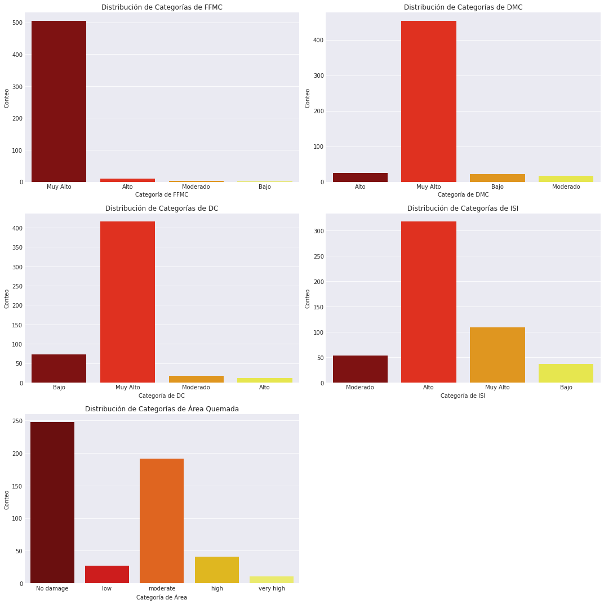
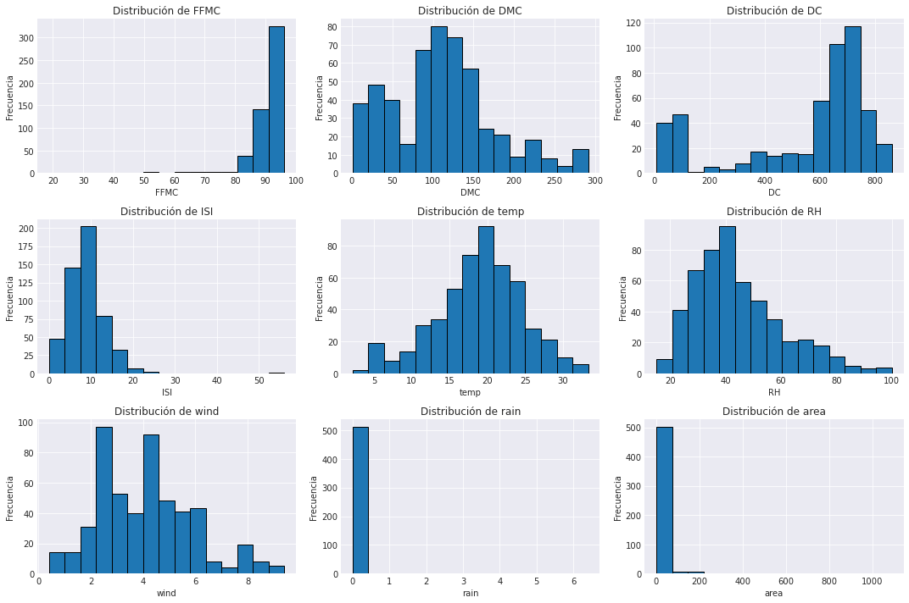
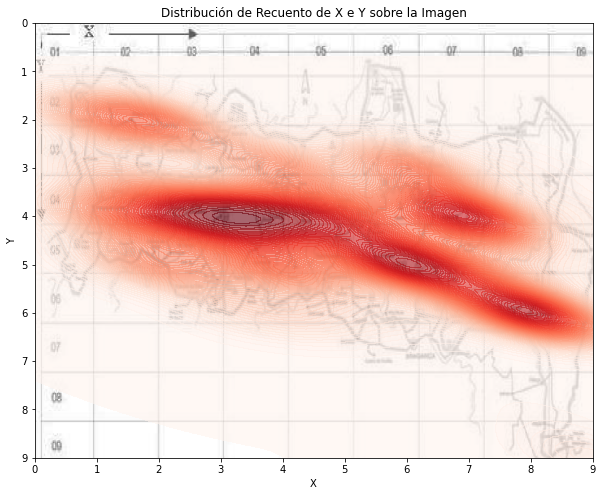
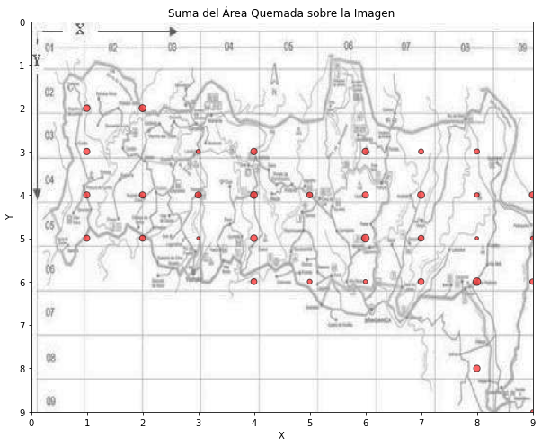
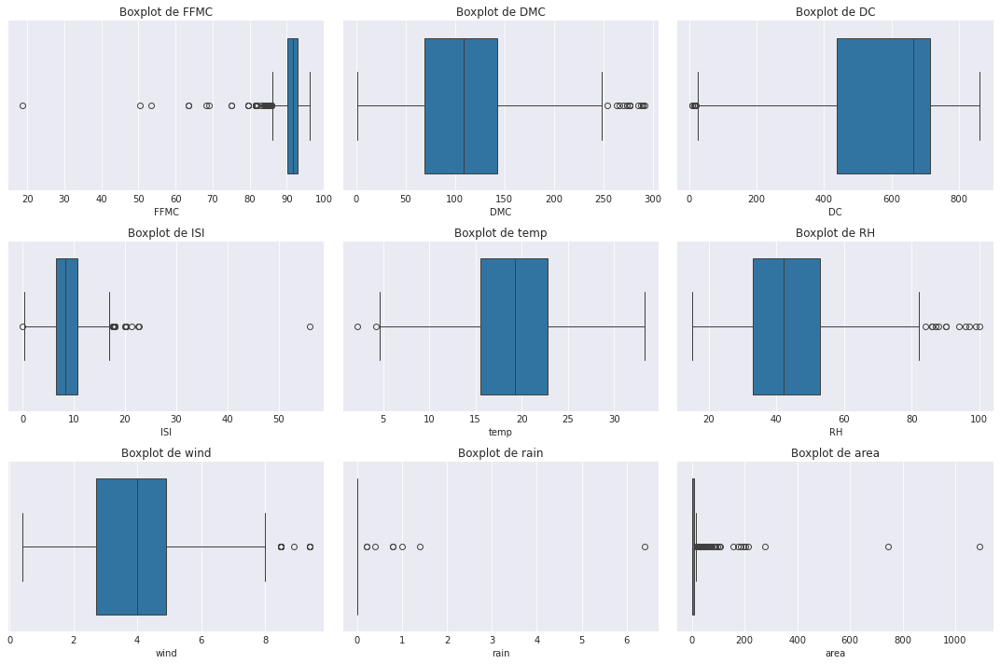
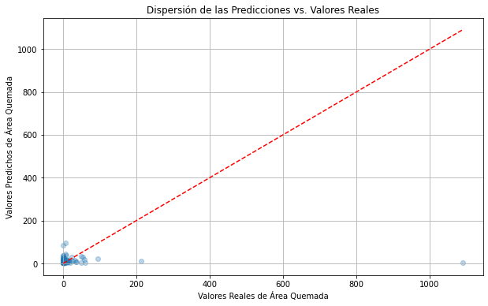
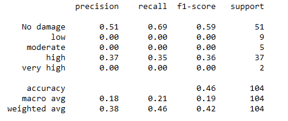
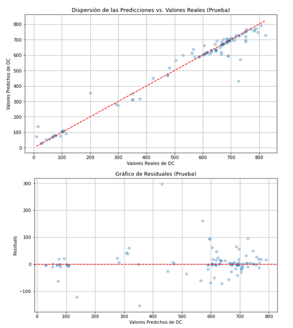

# Proyect Final: Análisis y predicción de incendios forestales

## Introducción

Este proyecto tiene como objetivo analizar un dataset de incendios forestales, realizar un análisis exploratorio de datos (EDA), y desarrollar modelos predictivos utilizando técnicas de regresión y redes neuronales.

Origen de datos: https://archive.ics.uci.edu/dataset/162/forest+fires

Presentación del proyecto: https://docs.google.com/presentation/d/1sWRA_9oocevOj-AoAo6OxxTZzn6hmq5VXMa_HdzkG_U/edit?usp=sharing

Este proyecto forma parte de Bootcamp de Data Science que ofrece Ironhack en colaboración con el C


## Dataset

El dataset utilizado en este proyecto contiene información sobre incendios forestales, incluyendo características meteorológicas, índices de inflamabilidad, y el área quemada. El dataset se encuentra en el archivo `forestfires.csv`.

### Columnas del Dataset

- `X`: Coordenada X del incendio (horizontal).
- `Y`: Coordenada Y del incendio (vertical).
- `month`: Mes en el que ocurrió el incendio.
- `day`: Día de la semana en el que ocurrió el incendio.
- `FFMC`: Índice de humedad de los combustibles finos.
- `DMC`: Índice de humedad del manto muerto.
- `DC`: Índice de sequía.
- `ISI`: Índice de propagación inicial.
- `temp`: Temperatura en grados Celsius.
- `RH`: Humedad relativa en porcentaje.
- `wind`: Velocidad del viento en km/h.
- `rain`: Lluvia en mm.
- `area`: Área quemada en hectáreas.

#### Detalle de las columnas

**FFMC**:
En el contexto de los incendios forestales, "FFMC" se refiere a Fine Fuel Moisture Code. Es un índice utilizado en el Sistema de Predicción de Incendios Forestales de Canadá (Canadian Forest Fire Weather Index System). El FFMC mide la humedad del material combustible fino, como hojas secas y pequeñas ramas, que son fácilmente inflamables. Este índice varía generalmente de 0 a 101, donde un valor más alto indica que el combustible está más seco y es más fácil que se encienda.
Aquí hay una breve descripción de lo que los diferentes valores de FFMC pueden indicar:
 - Bajo (0-30): Alta humedad, el material combustible está húmedo y es difícil que se encienda.
 - Moderado (31-60): Humedad moderada, las condiciones para que el material combustible se encienda son normales.
 - Alto (61-80): Baja humedad, el material combustible está seco y es más fácil que se encienda.
 - Muy Alto (81-101): Muy baja humedad, el material combustible está muy seco y es muy fácil que se encienda.

Este índice es parte de una serie de códigos e índices que ayudan a predecir la probabilidad y el comportamiento de los incendios forestales.

**DMC**: 
En el contexto de los incendios forestales, "DMC" se refiere a Duff Moisture Code. Es otro índice utilizado en el Sistema de Predicción de Incendios Forestales de Canadá (Canadian Forest Fire Weather Index System). El DMC mide la humedad de la capa intermedia de hojarasca o duff, que consiste en material orgánico parcialmente descompuesto que se encuentra por debajo de la capa de combustible fino pero por encima del suelo mineral.
Aquí hay una breve descripción de lo que los diferentes valores de DMC pueden indicar:
 - Bajo (0-10): Alta humedad, el material de duff está muy húmedo y es difícil que se encienda.
 - Moderado (11-20): Humedad moderada, las condiciones para que el material de duff se encienda son normales.
 - Alto (21-30): Baja humedad, el material de duff está seco y es más fácil que se encienda.
 - Muy Alto (31+): Muy baja humedad, el material de duff está muy seco y es muy fácil que se encienda.

El DMC es un indicador importante porque afecta la duración y la intensidad de los incendios forestales, ya que el material de duff puede sostener la combustión durante períodos prolongados y puede ser más difícil de extinguir.


**DC**:
En el contexto de los incendios forestales, "DC" se refiere a Drought Code. Es otro índice utilizado en el Sistema de Predicción de Incendios Forestales de Canadá (Canadian Forest Fire Weather Index System). El DC mide la humedad de los combustibles pesados y profundos, como los troncos podridos y la materia orgánica acumulada en el suelo. Este índice es un indicador de la sequedad de estos materiales que pueden arder lentamente durante mucho tiempo.
Aquí hay una breve descripción de lo que los diferentes valores de DC pueden indicar:
 - Bajo (0-100): Alta humedad, los combustibles pesados están muy húmedos y es difícil que se enciendan.
 - Moderado (101-200): Humedad moderada, las condiciones para que los combustibles pesados se enciendan son normales.
 - Alto (201-300): Baja humedad, los combustibles pesados están secos y es más fácil que se enciendan.
 - Muy Alto (300+): Muy baja humedad, los combustibles pesados están muy secos y es muy fácil que se enciendan.

El DC es especialmente útil para predecir la probabilidad de incendios profundos y duraderos, ya que los combustibles que mide pueden arder durante períodos prolongados y son difíciles de extinguir.


**ISI**:
En el contexto de los incendios forestales, "ISI" se refiere a Initial Spread Index. Es un componente del Sistema de Predicción de Incendios Forestales de Canadá (Canadian Forest Fire Weather Index System) y mide la velocidad inicial de propagación de un incendio forestal. El ISI combina el efecto del viento y la sequedad del combustible fino para estimar la rapidez con la que un incendio puede propagarse inmediatamente después de iniciarse.
Aquí hay una breve descripción de lo que los diferentes valores de ISI pueden indicar:
 - Bajo (0-3): Baja velocidad de propagación, el incendio se extenderá lentamente.
 - Moderado (4-6): Velocidad de propagación moderada, el incendio se extenderá a una velocidad normal.
 - Alto (7-12): Alta velocidad de propagación, el incendio se extenderá rápidamente.
 - Muy Alto (13+): Muy alta velocidad de propagación, el incendio se extenderá muy rápidamente.

El ISI es útil para predecir la rapidez con la que un incendio puede expandirse en sus primeras etapas, lo cual es crucial para la planificación de la respuesta y las estrategias de contención.

## Análisis Exploratorio de Datos (EDA)

Se realizó un análisis exploratorio de datos para entender mejor la distribución de las características y su relación con el área quemada. Algunas de las tareas incluidas en el EDA son:

- **Categorización**:
  - `FFMC`, `DMC`, `DC`, `ISI` fueron categorizados en niveles de riesgo como `Bajo`, `Moderado`, `Alto`, `Muy Alto`.
  - `area` fue categorizada en `No damage`, `low`, `moderate`, `high`, `very high`.



- **Distribución de Recuentos**:
  - Se generaron gráficos de barras para visualizar la distribución de recuentos de las categorías `FFMC`, `DMC`, `DC`, `ISI`, y `area`.



- **Distribución Geográfica**:
  - Se visualizó la distribución geográfica de los incendios en un mapa, mostrando la suma del área quemada en cada ubicación `X`, `Y`.

  

  

- **Detección de Outliers**:
  - Se detectaron varios valores que se distanician significativamente de la distribución normal de los campos. Una vez analizados se ha detectado que no son valores incorrectos, sino que son valores propios del dataset. Cómo veremos en las prediccions, esto dificulta en gran medida les predicción de los datasets:



Se desarrolló un modelo de regresión basado en Random Forest para predecir el índice de sequía (`DC`).

- **Preprocesamiento**:
  - Las características numéricas fueron estandarizadas.
  - Las variables categóricas fueron codificadas utilizando One-Hot Encoding.

- **Evaluación del Modelo**:
  - El modelo fue evaluado utilizando K-Fold Cross-Validation y se reportó el R² y el Mean Squared Error (MSE).

## Modelos Desarrollados y validados

### Área Quemada - Regresión
  - Modelo: Random Forest Regressor 
  - R² prueba: -0.035
  - R² entrenamiento: 0.81
  - Error Cuadrático Medio: 110.50ha
  - Características usadas: Todas excepto Month y área.



### Área Quemada - Red neuronal
  - Modelo: Secuencial (feed-forward)
  - Épocas: 100
  - Tamaño de Lote: 32
  - Conjunto de Validación: Se utiliza el 20% de los datos para validar el modelo durante el entrenamiento.



### Índice de Sequía (DC)- Regresión
  - Modelo: Random Forest Regressor 
  - R² C. prueba: 0.96
  - Error Cuadrático Medio: 63.25
  - Características usadas: Todas excepto DC y área.



## Resultados

- **Análisis Exploratorio**:
  - Se observaron patrones interesantes en la distribución geográfica de los incendios y en las características meteorológicas.
  - Se notó que la mayoría de los incendios afectaron áreas pequeñas, pero hubo algunas excepciones con áreas quemadas significativamente grandes.

- **Modelo de Regresión para Área Quemada**:
  - El modelo Random Forest logró un R² moderado, lo que indica que algunas variaciones en el área quemada pueden explicarse por las características usadas.

- **Modelo de Red Neuronal para Categoría de Área Quemada**:
  - La red neuronal mostró un rendimiento aceptable en la predicción de categorías de área quemada, aunque podría beneficiarse de más datos o ajustes adicionales.

- **Modelo de Regresión para DC**:
  - El modelo Random Forest para predecir DC mostró un buen rendimiento con un R² alto, indicando una buena capacidad predictiva basada en las características proporcionadas.

## Conclusiones

- **Importancia de las Variables Meteorológicas**:
  - Los índices como `FFMC`, `DMC`, `DC`, e `ISI` son cruciales para predecir tanto el área quemada como la categoría del área.

- **Limitaciones**:
  - La precisión en la predicción del área quemada se ve limitada por la variabilidad y posibles sesgos en los datos.

- **Próximos Pasos**:
  - Continuar con el ajuste de los modelos, explorar otras arquitecturas de redes neuronales, y posiblemente aumentar el tamaño del dataset para mejorar la generalización de los modelos.

## Devtools

Herramientas necesarias para la ejecución del código:

```
Python 3.10.12
Jupyter notebook
```

Módulos python necesarios:

```
pandas
numpy
matplotlib
seaborn
scikit-learn
tensorflow
```